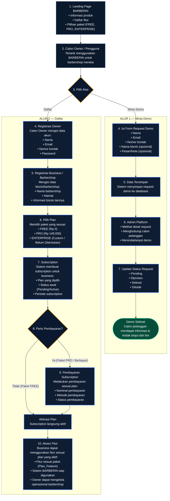
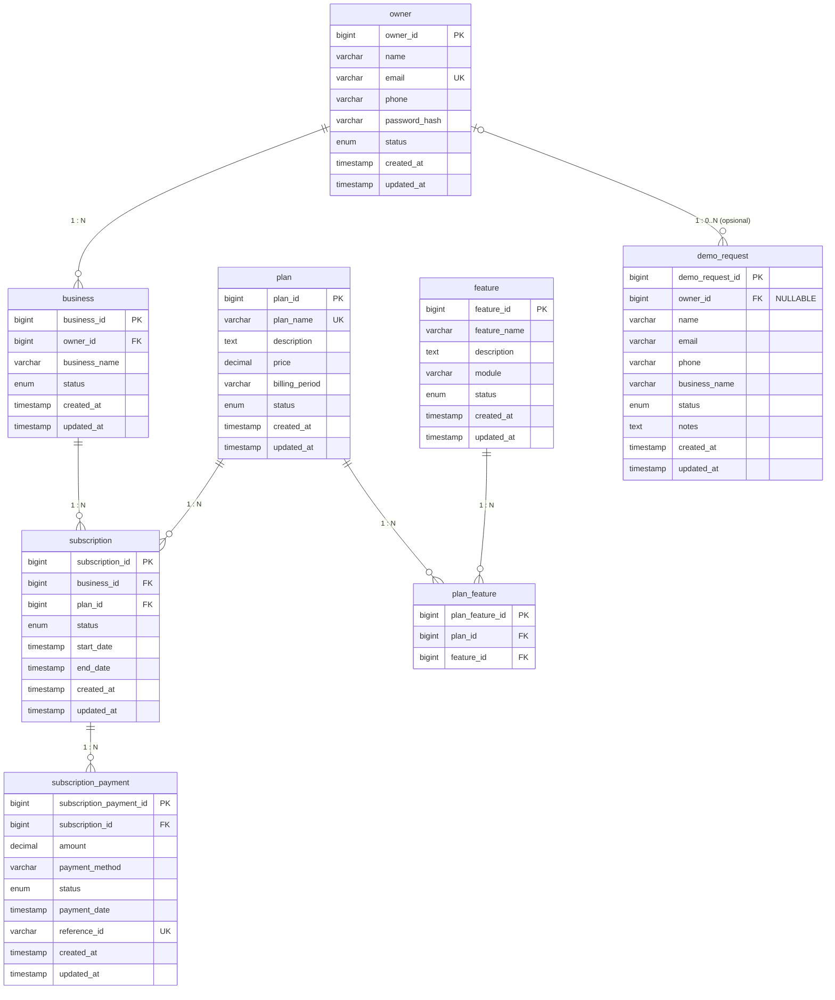

# BARBERIN — BUSINESS FLOW & ERD SAAS PLATFORM (ADMIN PLATFORM)

Dokumen ini merupakan acuan arsitektur resmi untuk modul **Owner / SaaS Platform BARBERIN**, merujuk langsung pada spesifikasi visual:
- **Gambar 1**: *BARBERIN — Business Flow Admin Platform (BPMN)*
- **Gambar 2**: *BARBERIN SaaS Platform — ERD (Admin Platform)*

---

## 1. BUSINESS FLOW / BPMN ADMIN PLATFORM (GAMBAR 1)

### 1.1 Diagram Alur Lengkap



### 1.2 Detail Komponen Alur BPMN

#### A. Landing Page BARBERIN (Node 1)
Calon pengguna dapat:
- Melihat informasi produk platform SaaS BARBERIN.
- Melihat daftar lengkap fitur yang disediakan.
- Melihat pilihan paket langganan: **FREE**, **PRO**, dan **ENTERPRISE**.

#### B. Calon Owner / Pengguna (Node 2)
Pemilik barbershop yang tertarik mengadopsi sistem digital BARBERIN untuk bisnis mereka.

#### C. Decision Gateway: Pilih Aksi (Node 3)
Tersedia dua opsi tindakan:
1. **Minta Demo**: Untuk calon klien yang ingin melihat peragaan sistem terlebih dahulu bersama tim sales/support platform.
2. **Daftar**: Untuk calon owner yang siap mendaftar langsung secara mandiri.

---

### 1.3 Alur 1 — Minta Demo
1. **Isi Form Request Demo (Node 4)**: Calon Owner mengisi form permintaan demo dengan data:
   - Nama lengkap
   - Email aktif
   - Nomor kontak / WhatsApp
   - Nama bisnis (opsional)
   - Pesan / catatan kebutuhan (opsional)
2. **Data Tersimpan (Node 5)**: Sistem menyimpan data ke tabel `demo_request` di database.
3. **Admin Platform (Node 6)**: Admin Platform BARBERIN menerima notifikasi request demo baru, melihat detail, menghubungi calon pelanggan, dan menjadwalkan/melakukan sesi demo.
4. **Update Status Request (Node 7)**: Status request demo dapat diubah oleh Admin Platform:
   - `Pending`: Request baru masuk.
   - `Diproses`: Sedang dihubungi / dijadwalkan demo.
   - `Selesai`: Sesi demo telah tuntas dilaksanakan.
   - `Ditolak`: Request tidak valid atau dibatalkan.
5. **Demo Selesai**: Calon pelanggan memperoleh tindak lanjut dan informasi pendaftaran sistem.

---

### 1.4 Alur 2 — Registrasi & Langganan (Daftar)
1. **Registrasi Owner (Node 4)**: Calon Owner membuat akun dengan mengisi:
   - Nama lengkap
   - Email unik
   - Nomor kontak
   - Password (disimpan sebagai `password_hash`)
2. **Registrasi Business / Barbershop (Node 5)**: Mengisi data entitas bisnis:
   - Nama barbershop / usaha
   - Alamat operasional
   - Informasi bisnis lainnya
3. **Pilih Plan (Node 6)**: Memilih paket SaaS yang diinginkan:
   - **FREE** (Rp 0): Fitur dasar, 1 cabang barbershop.
   - **PRO** (Rp 149.000 / bulan): Fitur penuh tanpa batasan transaksi.
   - **ENTERPRISE** (Custom / Belum Ditentukan): Fitur kustom multi-cabang & integrasi khusus.
4. **Subscription (Node 7)**: Sistem menginisiasi record langganan di tabel `subscription`:
   - Plan yang dipilih
   - Status awal (`Pending` jika berbayar, `Active` jika gratis)
   - Periode subscription (`start_date` dan `end_date`)
5. **Decision Gateway: Perlu Pembayaran? (Node 8)**:
   - **Jika TIDAK (FREE Plan)**:
     - Langsung menuju **Aktivasi Plan** (`status` = `active`).
     - Lanjut ke **Akses Fitur**.
   - **Jika YA (PRO / Berbayar)**:
     - **Pembayaran Subscription (Node 9)**: Owner melakukan pembayaran tagihan SaaS:
       - Nominal pembayaran (`amount`)
       - Metode pembayaran (`qris`, `transfer`, `credit_card`)
       - Status pembayaran (`success`, `pending`, `failed`)
     - Setelah terverifikasi, sistem melakukan **Aktivasi Plan**.
6. **Akses Fitur (Node 10)**:
   - Business mendapatkan hak akses fitur sesuai paket (`plan_feature`).
   - Sistem BARBERIN siap digunakan.
   - Owner dapat mulai mengelola operasional barbershop (Layanan, Capster, Transaksi, Gaji, Audit Aktivitas, dan Audit Keuangan).

---

## 2. ERD SAAS PLATFORM / ADMIN PLATFORM (GAMBAR 2)

### 2.1 Diagram Relasi Entitas (ERD)



---

### 2.2 Kamus Data Entitas (Data Dictionary)

#### 1. Entitas `owner`
Menyimpan data pemilik akun / platform customer yang menggunakan BARBERIN.
- `owner_id`: BIGINT (Primary Key, auto increment / identity).
- `name`: VARCHAR(255) — Nama lengkap pemilik akun.
- `email`: VARCHAR(255) (Unique) — Alamat email terdaftar untuk login.
- `phone`: VARCHAR(50) — Nomor telepon / WhatsApp owner.
- `password_hash`: VARCHAR(255) — Hash kata sandi terenkripsi.
- `status`: ENUM (`active`, `inactive`, `suspended`) — Status akun owner.
- `created_at`: DATETIME / TIMESTAMP — Waktu registrasi.
- `updated_at`: DATETIME / TIMESTAMP — Waktu perubahan profil.

#### 2. Entitas `business`
Menyimpan data bisnis / barbershop yang berada di bawah kepemilikan Owner.
- `business_id`: BIGINT (Primary Key, auto increment / identity).
- `owner_id`: BIGINT (Foreign Key → `owner.owner_id`) — Relasi ke pemilik.
- `business_name`: VARCHAR(255) — Nama brand / barbershop.
- `status`: ENUM (`active`, `inactive`, `suspended`) — Status operasional bisnis.
- `created_at`: DATETIME / TIMESTAMP — Waktu bisnis dibuat.
- `updated_at`: DATETIME / TIMESTAMP — Waktu pemutakhiran profil bisnis.

#### 3. Entitas `plan`
Menyimpan katalog paket langganan SaaS BARBERIN (**FREE**, **PRO**, **ENTERPRISE**).
- `plan_id`: BIGINT (Primary Key, auto increment / identity).
- `plan_name`: VARCHAR(100) (Unique) — Nama paket (contoh: "FREE", "PRO", "ENTERPRISE").
- `description`: TEXT — Deskripsi cakupan dan keunggulan paket.
- `price`: DECIMAL(12, 2) — Harga paket (FREE = 0, PRO = 149.000).
- `billing_period`: VARCHAR(50) — Siklus penagihan (contoh: "monthly", "yearly").
- `status`: ENUM (`active`, `archived`) — Ketersediaan paket untuk dipilih.
- `created_at`: DATETIME / TIMESTAMP — Waktu paket dirilis.
- `updated_at`: DATETIME / TIMESTAMP — Waktu perubahan paket.

#### 4. Entitas `feature`
Mendefinisikan daftar modul / fitur kapabilitas sistem BARBERIN.
- `feature_id`: BIGINT (Primary Key, auto increment / identity).
- `feature_name`: VARCHAR(255) — Nama fitur (contoh: "Manajemen Akun Capster", "Audit Keuangan").
- `description`: TEXT — Keterangan fungsionalitas fitur.
- `module`: VARCHAR(100) — Kelompok modul (contoh: "owner", "capster", "customer").
- `status`: ENUM (`active`, `inactive`) — Status fitur pada platform.
- `created_at`: DATETIME / TIMESTAMP — Waktu pencatatan fitur.
- `updated_at`: DATETIME / TIMESTAMP — Waktu pemutakhiran.

#### 5. Entitas `plan_feature`
Menghubungkan paket langganan dengan fitur-fitur yang berhak diakses (Relasi Many-to-Many).
- `plan_feature_id`: BIGINT (Primary Key, auto increment / identity).
- `plan_id`: BIGINT (Foreign Key → `plan.plan_id`).
- `feature_id`: BIGINT (Foreign Key → `feature.feature_id`).

#### 6. Entitas `subscription`
Menyimpan riwayat dan status langganan business terhadap paket tertentu.
- `subscription_id`: BIGINT (Primary Key, auto increment / identity).
- `business_id`: BIGINT (Foreign Key → `business.business_id`).
- `plan_id`: BIGINT (Foreign Key → `plan.plan_id`).
- `status`: ENUM (`pending`, `active`, `expired`, `cancelled`).
- `start_date`: DATETIME / TIMESTAMP — Awal masa aktif langganan.
- `end_date`: DATETIME / TIMESTAMP — Akhir masa aktif langganan.
- `created_at`: DATETIME / TIMESTAMP — Waktu transaksi subscription dibuat.
- `updated_at`: DATETIME / TIMESTAMP — Waktu pemutakhiran status langganan.

#### 7. Entitas `subscription_payment`
Menyimpan transaksi pembayaran langganan SaaS BARBERIN (kepada platform).
- `subscription_payment_id`: BIGINT (Primary Key, auto increment / identity).
- `subscription_id`: BIGINT (Foreign Key → `subscription.subscription_id`).
- `amount`: DECIMAL(12, 2) — Nominal tagihan yang dibayarkan.
- `payment_method`: VARCHAR(50) — Metode bayar (contoh: "qris", "transfer", "credit_card").
- `status`: ENUM (`pending`, `success`, `failed`, `refunded`).
- `payment_date`: DATETIME / TIMESTAMP — Waktu pembayaran dieksekusi.
- `reference_id`: VARCHAR(255) (Unique) — ID referensi transaksi gateway / mutasi transfer.
- `created_at`: DATETIME / TIMESTAMP — Waktu invoice diterbitkan.
- `updated_at`: DATETIME / TIMESTAMP — Waktu rekonsiliasi pembayaran.

#### 8. Entitas `demo_request`
Menyimpan permintaan demo sistem dari calon klien.
- `demo_request_id`: BIGINT (Primary Key, auto increment / identity).
- `owner_id`: BIGINT (Foreign Key → `owner.owner_id`, **NULLABLE**).
- `name`: VARCHAR(255) — Nama kontak pemohon.
- `email`: VARCHAR(255) — Email kontak pemohon.
- `phone`: VARCHAR(50) — Nomor telepon pemohon.
- `business_name`: VARCHAR(255) — Nama barbershop / usaha calon pelanggan.
- `status`: ENUM (`pending`, `diproses`, `selesai`, `ditolak`).
- `notes`: TEXT — Catatan atau pertanyaan tambahan.
- `created_at`: DATETIME / TIMESTAMP — Waktu request dikirim.
- `updated_at`: DATETIME / TIMESTAMP — Waktu status request diperbarui.

---

### 2.3 Tabel Kardinalitas Relasi (Sesuai Gambar 2 Bagian D)

| Relasi | Kardinalitas | Keterangan Bisnis |
|:---|:---:|:---|
| **Owner → Business** | `1 : N` | Satu Owner dapat memiliki satu atau beberapa Business/Barbershop. |
| **Business → Subscription** | `1 : N` | Satu Business memiliki banyak riwayat Subscription sepanjang waktu. |
| **Plan → Subscription** | `1 : N` | Satu Plan dapat digunakan oleh banyak entitas Business. |
| **Plan → Plan_Feature** | `1 : N` | Satu Plan memiliki banyak konfigurasi akses fitur. |
| **Feature → Plan_Feature** | `1 : N` | Satu Feature dapat dipetakan ke beberapa Plan. |
| **Subscription → Subscription_Payment** | `1 : N` | Satu Subscription dapat memiliki banyak transaksi pembayaran/perpanjangan. |
| **Owner → Demo_Request** | `1 : 0..N` | Demo Request dapat berasal dari Owner terdaftar ataupun calon klien publik (opsional). |

---

## 3. BATASAN ARSITEKTUR & PEMISAHAN LAPISAN

```
┌────────────────────────────────────────────────────────────────────────┐
│                   LAPISAN SAAS PLATFORM / ADMIN                        │
│                                                                        │
│   [owner] ──1:N──> [business] ──1:N──> [subscription] ──1:N──> [payment]
│     │                                         │                        │
│   0..N (opsional)                           1:N                        │
│     ▼                                         ▼                        │
│ [demo_request]                     [plan] ──1:N──> [plan_feature]      │
│                                                       ▲                │
│                                                      1:N               │
│                                                       │                │
│                                                  [feature]             │
└────────────────────────────────────────────────────────────────────────┘
                                    │
               Pemisahan Logis & Akses Operasional Berlisensi
                                    ▼
┌────────────────────────────────────────────────────────────────────────┐
│                   LAPISAN OPERASIONAL BARBERSHOP                       │
│                                                                        │
│   • users (pelanggan, capster, owner)                                  │
│   • barbershop (outlet fisik & profil)                                 │
│   • capster & shift_capster (jadwal, check-in, end-shift)              │
│   • layanan (katalog jasa potong, cuci, styling)                       │
│   • booking & detail_booking                                           │
│   • transaksi & pembayaran (transaksi potong rambut harian)            │
│   • struk & cetak invoice PDF                                          │
│   • pembatalan & alasan_pembatalan (audit pembatalan order)            │
│   • pemeriksaan_keuangan (audit fisik kas & cash on hand)              │
└────────────────────────────────────────────────────────────────────────┘
```

> [!IMPORTANT]
> **Prinsip Isolasi Transaksi:**
> 1. **Pembayaran SaaS (`subscription_payment`)**: Pembayaran dari pemilik barbershop (Owner) kepada penyedia platform BARBERIN untuk biaya sewa software / lisensi bulanan.
> 2. **Pembayaran Layanan (`pembayaran`)**: Pembayaran dari customer barbershop kepada kasir/capster atas layanan potong rambut yang telah dikerjakan di outlet.
> 3. Kedua transaksi ini memiliki alur rekonsiliasi, siklus, dan pembukuan yang sepenuhnya terpisah.
